<div align="center">





</div>

```text
arbab@m1pro:~$ cat /proc/operator
name     : arbab mujtaba
base     : IET DAVV, Indore  <-  Sopore, Kashmir
rig      : MacBook Pro 14" M1 Pro // Arch Linux ARM + Asahi // Hyprland
focus    : apple silicon linux · thermals · sensors · audio DSP
also     : python backend · LLM tuning + RAG · computer vision
seeking  : asahi linux collaborators · help with thermals
```

<div align="center">


<br/><br/>

<a href="https://arbabmujtaba.github.io"></a>
<a href="https://arbabmujtaba.github.io/journal"></a>
<a href="https://twitter.com/arbabmujtaba24"></a>
<a href="https://linkedin.com/in/arbabmujtaba"></a>
<a href="mailto:arbabandjones@gmail.com"></a>

<br/><br/>

<code>code. break. understand. rebuild.</code>

</div>
